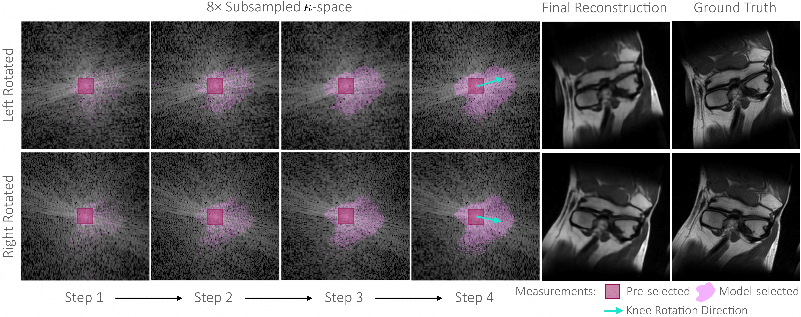
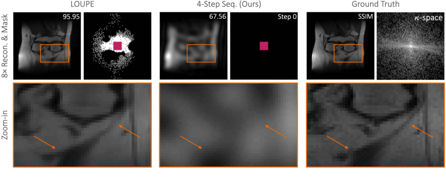
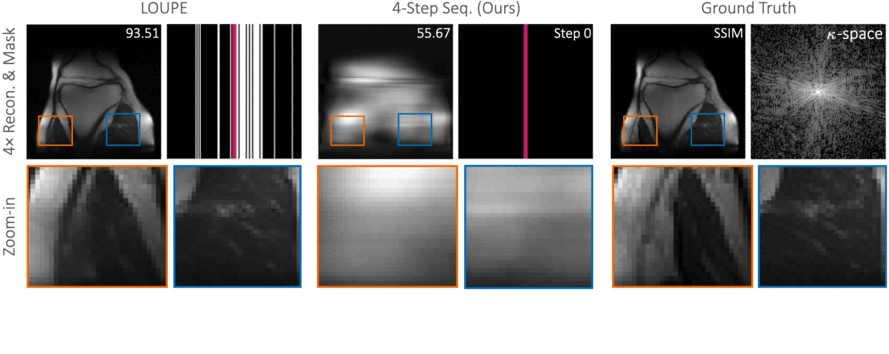

# End-to-End Sequential Sampling and Reconstruction for MR Imaging

  

  

  

> [**End-to-End Sequential Sampling and Reconstruction for MR Imaging**](http://arxiv.org/abs/2105.06460),            
> Tianwei Yin*, Zihui Wu*, He Sun, Adrian V. Dalca, Yisong Yue, Katherine L. Bouman (*equal contributions)         
> *arXiv technical report ([arXiv 2006.11275](http://arxiv.org/abs/2105.06460))*  

    @article{yin2021end,
      title={End-to-End Sequential Sampling and Reconstruction for MR Imaging},
      author={Yin, Tianwei, and Wu, Zihui and Sun, He and Dalca, Adrian V. and Yue, Yisong and Bouman, Katherine L.},
      journal={arXiv preprint},
      year={2021},
    }

## Contact
Any questions or suggestions are welcome!

Tianwei Yin [yintianwei@utexas.edu](mailto:yintianwei@utexas.edu)
Zihui Wu [zwu2@caltech.edu](mailto:zwu2@caltech.edu)

## Abstract
Accelerated MRI shortens acquisition time by subsampling in the measurement k-space. Recovering a high-fidelity anatomical image from subsampled measurements requires close cooperation between two components: (1) a sampler that chooses the subsampling pattern and (2) a reconstructor that recovers images from incomplete measurements. In this paper, we leverage the sequential nature of MRI measurements, and propose a fully differentiable framework that jointly learns a sequential sampling policy simultaneously with a reconstruction strategy. This co-designed framework is able to adapt during acquisition in order to capture the most informative measurements for a particular target (Figure 1). Experimental results on the fastMRI knee dataset demonstrate that the proposed approach successfully utilizes intermediate information during the sampling process to boost reconstruction performance. In particular, our proposed method outperforms the current state-of-the-art baseline on up to 96.96% of test samples. We also investigate the individual and collective benefits of the sequential sampling and co-design strategies.

## Main Results 

#### Line-constrained Sampling

| Model   | Accelearation | SSIM |
|---------|---------------|------|
| Loupe   |    4x         |  89.5    |
| Seq1   |    4x         |   90.8    |
| Seq4   |    4x         |   91.2    |

#### 2D Point Sampling 

| Model   | Accelearation | SSIM |
|---------|---------------|------|
| Loupe   |    4x         |  92.4    |
| Seq1   |    4x         |   92.7    |
| Seq4   |    4x         |   92.9     | 

## Installation

Please refer to [INSTALL](docs/INSTALL.md) to set up libraries.

## Getting Started 

Please refer to [GETTING_STARTED](docs/GETTING_STARTED.md) to prepare the data and follow the instructions to reproduce all results. 
You can use [figures.ipynb](figure_reproduction/figures.ipynb) to reproduce all the figures in the paper. 

## License

Seq-MRI is release under MIT license (see [LICENSE](LICENSE)). It is developed based on a forked version of [active-mri-acquisition](https://github.com/facebookresearch/active-mri-acquisition). We thank the original authors for their great codebase. 
